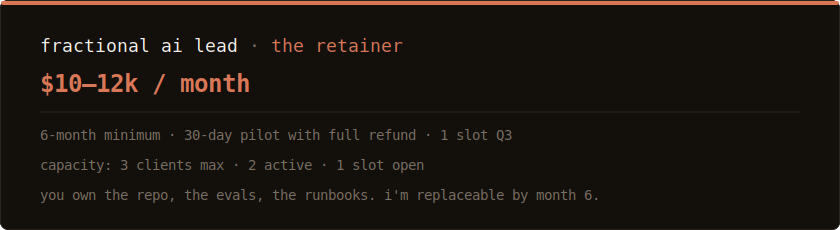
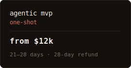
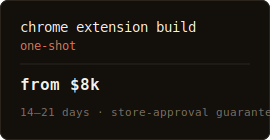
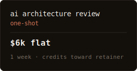

<!--
  theluckystrike/README.md  v8
  paste into:  github.com/theluckystrike/theluckystrike
-->

<!-- 1. HERO BANNER -->
<a href="mailto:lipmichal@gmail.com?subject=retainer%20inquiry"></a>

<!-- 2. VIEW COUNTER -->
<p align="center">
  
</p>

<!-- 3. CODE TYPEWRITER — the pitch as TypeScript -->
= 0.999); // handoff.md written. your team maintains." width="100%" />

<!-- 4. PITCH BLOCKQUOTE -->
> **the pitch in one line.**
> i embed with seed/series-a saas teams as their first ai engineer.
> ship agents, mcp servers, eval pipelines in 14-day cycles,
> then hand off a repo your team can actually maintain.
> typed everywhere. tested everywhere.
> claude code drives the keyboard. i drive claude.

---

<!-- 5. PROOF OF WORK -->
## § 01 · proof of work


[tab-suspender source](https://github.com/theluckystrike/zovo-tab-suspender-public) · [belikenative action](https://github.com/theluckystrike/belikenative-grammar-check) · [extension-toolkit](https://github.com/theluckystrike/chrome-extension-toolkit) · [claudecodeguides.com](https://claudecodeguides.com)

---

<!-- 6. THE RETAINER -->
## § 02 · the retainer — what most clients want

<a href="mailto:lipmichal@gmail.com?subject=retainer%20slot"></a>


---

<!-- 7. ONE-SHOT OFFERS -->
## § 03 · also available · one-shot

<table>
  <tr>
    <td width="33%"><a href="mailto:lipmichal@gmail.com?subject=agentic%20mvp"></a></td>
    <td width="33%"><a href="mailto:lipmichal@gmail.com?subject=chrome%20extension"></a></td>
    <td width="33%"><a href="mailto:lipmichal@gmail.com?subject=architecture%20review"></a></td>
  </tr>
</table>

```
the architecture review is the cheapest way to test fit.
$6k. one week. written report + diagram. credits to retainer if you sign.
```

---

<!-- 8. WHO THIS IS FOR — collapsed -->
<details>
<summary>§ 04 · who this is for</summary>

```
  [ok] seed -> series-b saas. 5-80 engineers. ai is on the roadmap or already shipped-and-stuck.
  [ok] founders who'd rather rent senior judgment than gamble on a $250k full-time hire.
  [ok] teams shipping to real users. production-grade evals matter more than demos.
  [no] pre-product startups looking for a co-founder. i build, i don't bet equity.
  [no] enterprises needing 6-month procurement cycles. i'm one person, paid in stripe.
  [no] "build me a chatgpt clone" briefs. i need a real problem.
```

</details>

<!-- 9. HOW THE WORK RUNS — collapsed -->
<details>
<summary>§ 05 · how the work runs · agentic engineering by default</summary>

```
  step 01   spec.md           -> written. signed. shared repo. success metrics named.
  step 02   failing.test.ts   -> vitest + playwright + eval harness before code.
  step 03   typed.code        -> ts everywhere. zod at every boundary. no any, no maybe.
  step 04   ci.green          -> no merge, no ship, no exception.
  step 05   deploy.sh         -> cloudflare. <60s rollback path. you have the keys.
  step 06   pair.day          -> weekly. one of your engineers pairs with me on review.
  step 07   handoff.md        -> runbooks. ADRs. eval failure playbooks. you maintain.
```

</details>

<!-- 10. HOW I WORK — collapsed -->
<details>
<summary>§ 06 · how i work — communication and commitment</summary>

```
this is my full-time job. my only income. i treat it accordingly.

communication:
  -> written-first. always. no exceptions.
  -> comprehensive reports after every sprint — you'll see exactly
     what was built, why, what changed, and what's next.
  -> async by default. i'm gmt+7, you're probably not.
  -> strongly prefer long-form written briefs over calls.
     if a call is needed, i'll ask — but it rarely is.
  -> every decision documented. every trade-off surfaced in writing.

commitment:
  -> this is not a side hustle. zero other clients beyond capacity.
  -> your project gets deep focus, not scattered attention.
  -> i ship daily. you see progress daily.
  -> if something is blocked, you know within hours — not days.

what you get that's different:
  -> reports that read like engineering docs, not status updates.
  -> zero meetings that could have been a message.
  -> a written paper trail you can search, reference, and hand off.
```

</details>

<!-- 11. RECEIPTS — collapsed -->
<details>
<summary>§ 07 · receipts</summary>

```
$ git log --oneline --author=theluckystrike --since="12 months ago" | head

  a3f8c12   feat(tab-suspender): mv3 service-worker rewrite · ship v2.1
  91d2e44   merge:  axios#6291 · keepAlive defaults restored
  b7e019a   merge:  google-chrome/chrome.dev#142 · ext-page typings
  4f1c8b3   feat(belikenative): mcp server · 70 rules · 18 l1-aware
  ce6a201   merge:  nicehash/nh-monorepo#88 · worker memory leak
  8dbf17f   feat(zovo-toolkit): wxt + plasmo dual scaffold
  2a4e9c1   merge:  microlinkhq/preview#56 · cls regression patch
  efd03b8   chore:  gh-actions · grammar-check · 60->70 rules
  19b6f72   merge:  scriptscat/scriptcat#214 · cookie-store typings
  c7b1f0d   feat:  mv2->mv3 migration #12 · zero rank loss
  ...
  total 12mo:  47,886 commits · 140 prs merged upstream · 0 regressions reverted
```

> **why open-source receipts matter at this stage.** i'm transparent: most of my deployed work is mine — 20 extensions, 10k+ users, 4.6 avg. i'm building a paid client portfolio now, and the trade is honest: hire me before the testimonial wall fills up, get senior shipping speed at a junior-consultant price. month-1 pilot is refundable for a reason.

</details>

---

<!-- 12. STACK — NOT collapsed, visible -->
## § 08 · stack


---

<!-- 13. GITHUB STATS — NOT collapsed, visible -->
## GitHub Stats

<p align="center">
  
</p>

<p align="center">
  
</p>


---

<!-- 14. LATEST POSTS -->
## Latest Posts

- [Building a Custom MCP Server for Claude Code](https://claudecodeguides.com/building-custom-mcp-server-claude-code/) — claudecodeguides.com
- [Best MCP Servers for Claude Code (2026)](https://claudecodeguides.com/best-mcp-servers-claude-code-2026/) — claudecodeguides.com
- [Advanced Claude Skills: Tool Use and Function Calling](https://claudecodeguides.com/advanced-claude-skills-with-tool-use-and-function-calling/) — claudecodeguides.com
- [Building Production AI Agents with Claude (2026)](https://claudecodeguides.com/building-production-ai-agents-with-claude-skills-2026/) — claudecodeguides.com
- [AI Code Assistant Chrome Extension](https://claudecodeguides.com/ai-code-assistant-chrome-extension/) — claudecodeguides.com

---

<!-- 15. WHERE TO FIND ME -->
## § 09 · where to find me


<p align="center">
  
</p>

---

<!-- 16. APPLY CTA -->
## § 10 · apply

<a href="mailto:lipmichal@gmail.com?subject=retainer%20application&body=company%3A%0Astage%3A%20seed%20%2F%20series%20a%20%2F%20series%20b%0Ateam.size%3A%0Aai.problem%3A%20%28one%20paragraph%29%0Abudget%3A%20retainer%20%2F%20one-shot%20%2F%20review%0Arepo.access%3A%20yes%20%2F%20no%0A"></a>


**[-> Apply for a Q3 retainer slot via email](mailto:lipmichal@gmail.com?subject=retainer%20application&body=company%3A%0Astage%3A%20seed%20%2F%20series%20a%20%2F%20series%20b%0Ateam.size%3A%0Aai.problem%3A%20%28one%20paragraph%29%0Abudget%3A%20retainer%20%2F%20one-shot%20%2F%20review%0Arepo.access%3A%20yes%20%2F%20no%0A)**

---

<!-- 17. BACKGROUND — collapsed -->
<details>
<summary><sub><code>$ ls ./background/</code></sub></summary>

<br />

cto-turned-solo-dev. 10+ years building software, leading infra, shipping product. founder of [zovo](https://zovo.one) and [belikenative](https://belikenative.com). three content sites, 4,200+ articles. da nang since 2022.

```
  contributions.last_year   47,886
  current.streak            64 days
  followers                 16
  organizations             trustwrx · belikenative
```

</details>

<!-- 18. FOOTER -->
---

<p align="center"><sub><code>built solo · shipped tested · <a href="mailto:lipmichal@gmail.com?subject=hello">lipmichal@gmail.com</a></code></sub></p>
